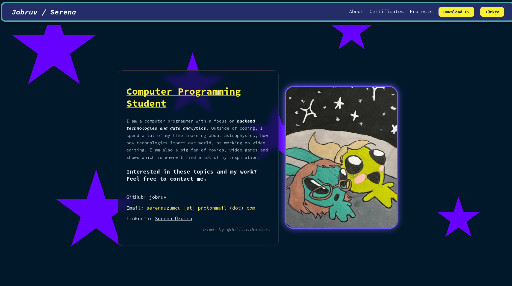

# My Portfolio

My first experience with React. Thanks to @delfin.doodles for letting me use her art in my portfolio.

## Sites I used

https://haikei.app/ for background image

https://delphi.tools/ almost everything

claude for helping with my design mistakes and translations to Turkish.

## Rough Notes for the future
<ul>
    <li>Rewriting "about me"</li>
    <li>Third party blog without updating the code itself</li>
        <ul>
            <li>Coding</li>
            <li>Editing</li>
            <li>Books (goodreads widget works too)</li>
            <li>Platforms I am on etc.</li>
        </ul>
    <li>Tools I use for language learning</li>
</ul>
